# My Personalized NeoVIm Setup

- [Impressions](#Impressions)
- Working with Buffers *and* Tabs
- Working with Windows

## Impressions

### Statusline and `CursorLineNr` follow the mode

| **Normal** | **Insert** | **Visual** | **Visual Line** | **Visual Block** | **Replace** | **Command** |
|-|-|-|-|-|-|-|
| 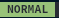 |  |  | 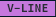 |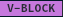 |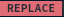 |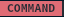 |
| 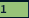 |  | 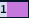 |  |  | 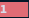 | 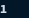 |

The `CursorLineNr` and the mode displayed in the statusline change appearance according to the current mode.

### Cursorline and `CursorLineNr` follow active window

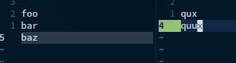
 
The colored cursorline slightly changes its background color between active and inactive windows.
In inactive windows the `CursorLineNr` has no background color.
This also applies to `cursorcolumn`.

### Rich buffer information per window

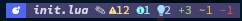
&nbsp;
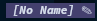
&nbsp;

 
Show rich information about the displayed buffer at the right top of a window.
The information includes
- an icon for the filetype, if available
- the file name
- a pen ✎ if the buffer contains unsaved changes
- diagnostics with symbols     and count
- Git file status of lines added, modified, and deleted

Only available information is shown, keeping the information panel minimal.

### Statusline for editor & cursor information

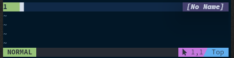
 
The statusline is minimal when no additional information is available.
We can see
- the current mode
- the cursor location
- the relative position in the file

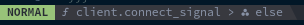
 
It shows LSP status (e.g. indexing progress) and location information when available.

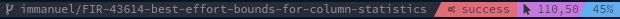
 
It shows the current Git branch when inside a Git repository.
It shows the current state of [asyncrun.vim](https://github.com/skywind3000/asyncrun.vim) so you always see when your project is building, the build succeeded, or the build failed

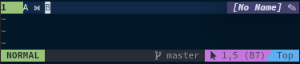
 
If you work with emojis, other unicode, or other multi-byte glyphs, then the visible column number and the byte count can diverge.
If this happens, the cursor position includes the byte the cursor is currently at.

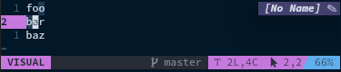
 
When visually selecting, the statusline shows the number of lines `L` and the number of characters `C` selected.

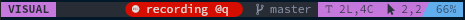
 
When recording a macro, the statusline prominently displays to which character the macro is being recorded.

### The tabline

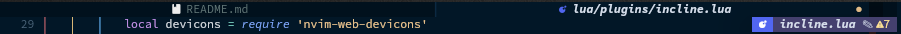

The tabline shows the path to the currently active buffer in that tab.
The yellow circle at the far right signals that the tab contains a modified and unsaved buffer.

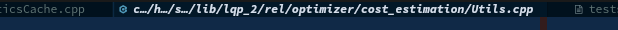

When paths become too long, they are cleverly shortened starting at the root until they fit the tab width.
(Of course, you can configure the tab width to your preference.
My tabs are very wide as I work on projects with deeply nested files.)

## Working with Buffers *and* Tabs

Some people like to use one tab per file, as most editors do.
Others prefer the original VIm way of having one tab per *window layout* and open buffers in the windows as they need them.
This setup supports both workflows.

You can use the Telescope pickers to open files in new tabs, splits, or in the current window.
With `<space>fb` you can quickly access the buffer picker, allowing you to view different files in your current layout.
The buffer picker is modified to pin the current buffer to the first entry and the most recently accessed buffer as second entry in the list, with the cursor starting on the second entry.
To jump back and forth between two buffers you simply type `<space>fb<cr>`.
In addition to the regular tab motions, `g<tab>` jumps to the most recently accessed tab.
This allows quickly jumping back and forth between two layouts.

## Working with Windows

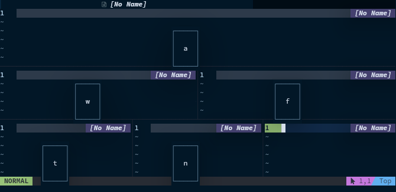

Pressing `<space><space>` allows for quickly picking a window in the current tab.
Simply press the key displayed in the window you want to go to, and you're there.
(The characters to use for picking windows can be configured, and in my setup are the home row of the Colemak Mod-DH keyboard layout.)
